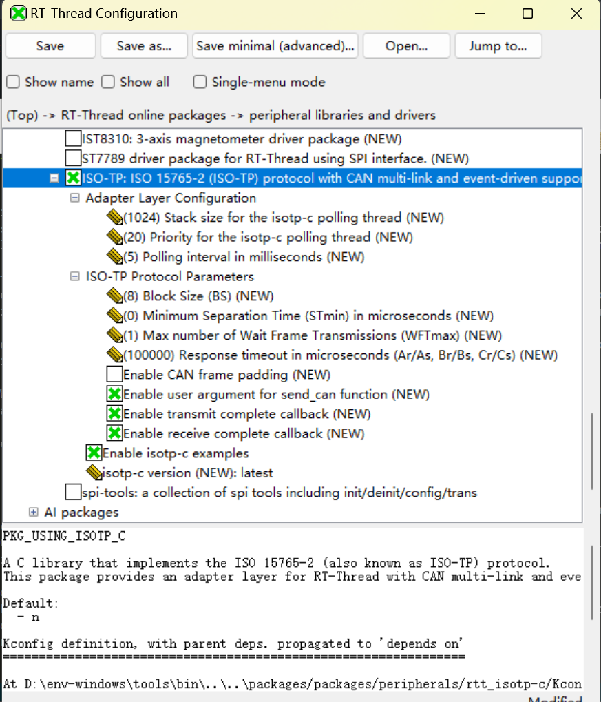

# isotp-c 适配软件包 for RT-Thread

[TOC]

## 0. 注意
- UDS:https://github.com/driftregion/iso14229 内置了iso-tp源码,此仓库仅为需要自行在多帧协议基础上自行扩展的使用.
- [iso14229 client demo](https://github.com/wdfk-prog/iso14229/tree/rtt/examples/rtt_server/client_demo)
- [iso14229 rtt software](https://github.com/wdfk-prog/can_uds)

## 1. 简介

**isotp-c 适配软件包** 为优秀的开源库 [isotp-c](https://github.com/SimonCahill/isotp-c) 提供了一个线程安全、事件驱动、支持多链接的适配层，使其能够轻松地在 RT-Thread 项目中集成和使用 ISO 15765-2 (也被称为 CAN-TP 或 ISO-TP) 协议。

本软件包专为汽车诊断 (UDS)、ECU 刷写以及任何需要在CAN总线上可靠传输大于8字节数据(即多帧传输)的场景而设计(可对接实现ymodem或其他)。它完全抽象了底层 `isotp-c` 库复杂的回调机制，为上层应用提供了一套简洁、高效的阻塞式API。

### 1.1 主要特性

*   **线程安全**: 提供阻塞式的 `send` 和 `receive` API，可被多个线程安全地调用。
*   **事件驱动**: 使用 RT-Thread 的事件机制进行高效的线程阻塞，避免了忙轮询。
*   **多链接支持**: 允许在单个或多个CAN总线上同时创建和管理多个 ISO-TP 链接。
*   **中断安全解耦**: 采用健壮的“生产者-消费者”模型（消息队列），将CAN中断服务程序(ISR)与协议处理逻辑完全解耦，确保系统稳定性。
*   **接口友好**: 实现了所有必需的 `isotp-c` 回调函数，向上层用户暴露简单清晰的公开API。
*   **高性能**: 底层 `isotp-c` 库本身是轻量且高效的，本适配层在设计上也致力于最小化额外开销。

### 1.2 目录结构

`isotp-c` 软件包的目录结构如下所示：

``` 
rtt_isotp-c
├───isotp-c                         // 原始 isotp-c 库源码
│   │   isotp.c                     // 核心协议实现
│   │   isotp.h                     // 核心协议头文件
│   └───...
├───examples                        // 示例代码
│   └───isotp_examples.c            // 功能全面的 MSH 命令示例
├───figures                         // 文档中使用的图片
│   isotp_rtt.c                     // 适配层的 RT-Thread 实现
│   isotp_rtt.h                     // 适配层的公开 API 头文件
│   LICENSE                         // 软件包许可证
│   README.md                       // 本说明文档
│   package.json                    // 软件包元数据
└───SConscript                      // SCons 构建脚本
```

### 1.3 许可证

isotp-c 适配软件包遵循 MIT 许可协议。详情请参阅 `LICENSE` 文件。其底层的 `isotp-c` 库同样遵循 MIT 许可协议。

### 1.4 依赖

*   RT-Thread 内核版本 >= 4.0.0
*   RT-Thread CAN 设备驱动框架 (`RT_USING_CAN`)
*   RT-Thread FinSH/MSH 命令行接口 (`RT_USING_FINSH`) (用于运行示例)

## 2. 如何使用

### 2.1 开启软件包

本软件包可以通过 Env 配置工具或 RT-Thread Studio 开启。配置路径如下：

`RT-Thread online packages -> peripherals -> ISO-TP`



开启软件包后，请保存配置并于项目根目录下执行 `pkgs --update` 命令。

### 2.2 API 使用方法

以下是一个简化的API使用示例。关于一个功能完整、可运行且包含资源管理的示例，请务必参考 `examples/isotp_examples.c` 文件。

**核心设计思想**：用户完全负责CAN报文的接收。推荐的最佳实践是采用“生产者-消费者”模型，即由CAN中断服务程序（生产者）将收到的报文投递到消息队列，再由一个专门的线程（消费者）取出并处理。

```c
#include "isotp_rtt.h"

/* --- 全局资源 --- */
static rt_device_t can_dev;
static rt_mq_t can_rx_mq; // 用于接收CAN报文的消息队列

/**
 * @brief CAN 接收回调函数 (生产者, 在ISR上下文中运行)
 */
static rt_err_t my_can_rx_callback(rt_device_t dev, rt_size_t size)
{
    struct rt_can_msg msg;
    if (rt_device_read(dev, 0, &msg, sizeof(msg)) == sizeof(msg))
    {
        /* 将报文发送到消息队列。此操作快速且非阻塞。*/
        rt_mq_send(can_rx_mq, &msg, sizeof(struct rt_can_msg));
    }
    return RT_EOK;
}

/**
 * @brief CAN 报文处理线程 (消费者, 在线程上下文中运行)
 */
void can_consumer_thread_entry(void *p)
{
    struct rt_can_msg msg;
    while(rt_mq_recv(can_rx_mq, &msg, sizeof(msg), RT_WAITING_FOREVER) == sizeof(msg))
    {
        /* 将取出的报文喂给 ISO-TP 适配层进行处理 */
        isotp_rtt_on_can_msg_received(&msg);
    }
}

void main_application_entry(void)
{
    // 1. 查找并打开您的CAN设备
    can_dev = rt_device_find("can1");
    rt_device_open(can_dev, RT_DEVICE_FLAG_INT_RX | RT_DEVICE_FLAG_INT_TX);
    
    // 2. 创建您的消费者线程和消息队列 (详情请参考示例)
    can_rx_mq = rt_mq_create("can_rx", sizeof(struct rt_can_msg), 32, RT_IPC_FLAG_FIFO);
    rt_thread_t tid = rt_thread_create("can_rx", can_consumer_thread_entry, RT_NULL, ...);
    if (tid) rt_thread_startup(tid);
    
    // 3. 为CAN设备设置您的接收回调函数
    rt_device_set_rx_indicate(can_dev, my_can_rx_callback);
    
    // 4. 创建一个 ISO-TP 链接
    static uint8_t send_buf, recv_buf;
    isotp_rtt_link_t my_link = isotp_rtt_create(can_dev, 0x7E0, 0x7E8, 
                                                RT_CAN_STDID, RT_CAN_DTR, 
                                                send_buf, sizeof(send_buf), 
                                                recv_buf, sizeof(recv_buf));
    
    // 5. 发送一帧报文
    uint8_t request[] = {0x22, 0xF1, 0x90};
    isotp_rtt_send(my_link, request, sizeof(request), RT_WAITING_FOREVER);
    
    // 6. 接收一帧响应
    uint8_t response;
    uint16_t recv_size;
    isotp_rtt_receive(my_link, response, sizeof(response), &recv_size, RT_WAITING_FOREVER);
}
```

## 3. 注意事项

*   本软件包依赖一个由适配层自动创建的后台轮询线程 (`isotp_poll`)。您可以在 Kconfig 菜单中配置其优先级和栈大小。
*   `isotp_rtt_on_can_msg_received()` 函数**绝对禁止**在中断服务程序(ISR)中直接调用。这样做可能会触发阻塞式的CAN发送，从而导致系统不稳定。
*   `examples/isotp_examples.c` 中的示例代码提供了一个非常健壮的MSH命令 (`isotp_example start`/`stop`)，它正确地处理了资源分配、清理以及CAN设备原始上下文的恢复。强烈建议您将其作为参考。

## 4. 测试验证

本软件包包含一个功能全面的示例，它模拟了一个诊断仪（客户端）通过两条独立的CAN总线与一个ECU（服务端）进行通信的场景。

1.  在 menuconfig 中使能 `PKG_USING_ISOTP_C` 和 `PKG_ISOTP_C_EXAMPLES`。
2.  确保您的BSP开启了两个CAN设备（例如 `can1`, `can2`），并将它们在物理上连接起来（CAN-H 对 CAN-H, CAN-L 对 CAN-L）。
3.  编译并下载固件。
4.  在 MSH 命令行中，运行 `isotp_example start`。

您将看到详细的通信日志，包括客户端发送的指令、服务端的响应、以及对响应数据的自动验证。

```sh
msh />isotp_example start
msh />11-05 13:42:38 isotp.example: Saving original rx_indicate and setting up new ones...
isotp.example: ISOTP example started successfully.
isotp.example: [Client] Tester thread started on can1.
isotp.rtt: ISO-TP link created for device:can1, SID:0x7E0, RID:0x7E8
isotp.example: [Server] ECU thread started on can2.
isotp.rtt: ISO-TP link created for device:can2, SID:0x7E8, RID:0x7E0
isotp.example: ------------------- Client Test Case 0 -------------------
isotp.rtt: [TX] ID: 0x7E0 [8 bytes]: 10 14 22 02 03 04 05 06
isotp.rtt: [RX] ID: 0x7E0 [8 bytes]: 10 14 22 02 03 04 05 06
isotp.rtt: [TX] ID: 0x0 [8 bytes]: 30 08 00 AA AA AA AA AA
isotp.rtt: [TX] ID: 0x7E8 [8 bytes]: 30 08 00 AA AA AA AA AA
isotp.rtt: [RX] ID: 0x0 [8 bytes]: 30 08 00 AA AA AA AA AA
isotp.rtt: [RX] ID: 0x7E8 [8 bytes]: 30 08 00 AA AA AA AA AA
isotp.rtt: [TX] ID: 0x7E0 [8 bytes]: 21 07 08 09 0A 0B 0C 0D
isotp.rtt: [RX] ID: 0x7E0 [8 bytes]: 21 07 08 09 0A 0B 0C 0D
isotp.rtt: [TX] ID: 0x7E0 [8 bytes]: 22 0E 0F 10 11 12 13 14
isotp.rtt: [RX] ID: 0x7E0 [8 bytes]: 22 0E 0F 10 11 12 13 14
isotp.rtt: [TX] ID: 0x7E8 [8 bytes]: 10 14 62 02 03 04 05 06
isotp.rtt: [RX] ID: 0x7E8 [8 bytes]: 10 14 62 02 03 04 05 06
isotp.rtt: [TX] ID: 0x7E0 [8 bytes]: 30 08 00 AA AA AA AA AA
isotp.rtt: [RX] ID: 0x7E0 [8 bytes]: 30 08 00 AA AA AA AA AA
isotp.rtt: [TX] ID: 0x7E8 [8 bytes]: 21 07 08 09 0A 0B 0C 0D
isotp.rtt: [RX] ID: 0x7E8 [8 bytes]: 21 07 08 09 0A 0B 0C 0D
isotp.rtt: [TX] ID: 0x7E8 [8 bytes]: 22 0E 0F 10 11 12 13 14
isotp.rtt: [RX] ID: 0x7E8 [8 bytes]: 22 0E 0F 10 11 12 13 14
isotp.example: [Server] Waiting for command...
isotp.example: [Client] VERIFICATION SUCCESS: Response is valid!
isotp.example: ------------------- Client Test Case 1 -------------------
isotp.example: [Client] Sending Command [20 bytes]: 22 02 03 04 05 06 07 08 09 0A 0B 0C 0D 0E 0F 10 11 12 13 1
isotp.example: [Server] Received Command [20 bytes]: 22 02 03 04 05 06 07 08 09 0A 0B 0C 0D 0E 0F 10 11 12 13 
isotp.example: [Server] Sending Response [20 bytes]: 62 02 03 04 05 06 07 08 09 0A 0B 0C 0D 0E 0F 10 11 12 13 
isotp.example: [Logger] Logged Command [20 bytes]: 22 02 03 04 05 06 07 08 09 0A 0B 0C 0D 0E 0F 10 11 12 13 14
isotp.example: [Server] Waiting for command...
isotp.example: [Client] Received Response [20 bytes]: 62 02 03 04 05 06 07 08 09 0A 0B 0C 0D 0E 0F 10 11 12 13
isotp.example: [Client] VERIFICATION SUCCESS: Response is valid!
isotp.example: ------------------- Client Test Case 2 -------------------
isotp.example: [Client] VERIFICATION SUCCESS: Response is valid!
```

上图日志清晰地展示了客户端发送一个20字节的指令，服务端和日志记录器都收到了该指令，随后服务端发送了一个有效的响应，最终客户端成功接收并验证了该响应。

## 5. 相关资料与文档
1. https://en.wikipedia.org/wiki/ISO_15765-2
2. https://docs.linuxkernel.org.cn/networking/iso15765-2.html
3. https://github.com/SimonCahill/isotp-c

## 6. 联系方式

*   维护： wdfk-prog
*   主页： https://github.com/wdfk-prog
