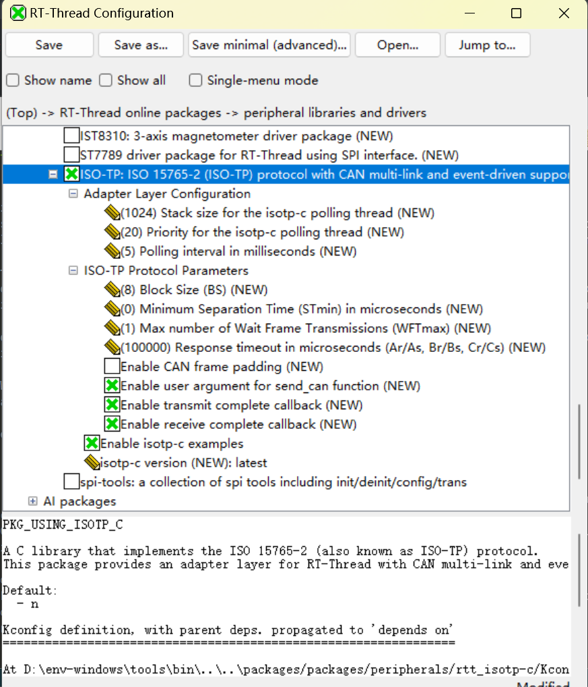

[中文说明](./readme_zh.md)

# rtt_isotp-c for RT-Thread

RT-Thread adapter package for the upstream [isotp-c](https://github.com/SimonCahill/isotp-c) library.

This package provides a thread-safe, event-driven adapter layer that integrates ISO 15765-2 (ISO-TP / CAN-TP) into RT-Thread projects. It is intended for UDS diagnostics, ECU flashing, and any application that needs to transport payloads larger than a single CAN frame.

Project site: https://wdfk-prog.space/rtt_isotp-c/

## Notes

- If you only need a ready-to-use UDS stack, start with [iso14229](https://github.com/wdfk-prog/iso14229).
- This repository focuses on the RT-Thread adapter around `isotp-c`, so it is better suited to projects that need to extend transport-layer behavior or integrate the transport layer into a custom application.
- The `isotp-c/` directory is an upstream submodule mirror. Treat it as **read-only** in this repository.
- Related examples:
  - [iso14229 client demo](https://github.com/wdfk-prog/iso14229/tree/rtt/examples/rtt_server/client_demo)
  - [can_uds](https://github.com/wdfk-prog/can_uds)

## Features

- Thread-safe blocking send and receive APIs.
- Optional non-blocking send API for queued transmission.
- Event-driven synchronization based on RT-Thread IPC objects.
- Support for multiple ISO-TP links on one or more CAN buses.
- Recommended producer-consumer receive model for ISR-safe CAN integration.
- Example application that demonstrates a client/server/logger topology.

## Repository Layout

```text
rtt_isotp-c/
├── isotp-c/                  # Upstream isotp-c submodule mirror (read-only here)
├── examples/
│   └── isotp_examples.c      # RT-Thread MSH example
├── figures/
│   └── config_menu.png       # Package enablement screenshot
├── isotp_rtt.c               # RT-Thread adapter implementation
├── isotp_rtt.h               # Public adapter API
├── LICENSE                   # Repository license (LGPL-2.1)
├── readme.md                 # English README (default)
├── readme_zh.md              # Chinese README
└── SConscript                # RT-Thread package build script
```

## License

This repository is distributed under **LGPL-2.1**; see the root `LICENSE` file. The bundled upstream `isotp-c` submodule uses its own license in `isotp-c/LICENSE`.

## Dependencies

- RT-Thread >= 4.0.0
- RT-Thread CAN device framework (`RT_USING_CAN`)
- FinSH/MSH if you want to run the example command (`RT_USING_FINSH`)

## Enable the Package

Enable the package from the RT-Thread package menu:

`RT-Thread online packages -> peripherals -> ISO-TP`



After enabling the package, save the configuration and run `pkgs --update` in the project root.

## Integration Model

The adapter is designed around a simple rule:

> CAN frame reception belongs to your application; ISO-TP reassembly belongs to the adapter.

The recommended model is:

1. Receive raw CAN frames in the CAN RX callback.
2. Push frames into a message queue from ISR context.
3. Consume those frames in a dedicated thread.
4. Call `isotp_rtt_on_can_msg_received()` only from thread context.

`isotp_rtt_on_can_msg_received()` must **not** be called directly from ISR context, because the protocol may need to transmit a Flow Control frame immediately.

## Quick Start

```c
#include "isotp_rtt.h"

static rt_device_t can_dev;
static rt_mq_t can_rx_mq;
static uint8_t send_buf[256];
static uint8_t recv_buf[256];

static rt_err_t my_can_rx_callback(rt_device_t dev, rt_size_t size)
{
    struct rt_can_msg msg;

    msg.hdr_index = -1;
    if (rt_device_read(dev, 0, &msg, sizeof(msg)) == sizeof(msg))
    {
        rt_mq_send(can_rx_mq, &msg, sizeof(struct rt_can_msg));
    }
    return RT_EOK;
}

static void can_consumer_thread_entry(void *parameter)
{
    struct rt_can_msg msg;

    while (rt_mq_recv(can_rx_mq, &msg, sizeof(msg), RT_WAITING_FOREVER) == sizeof(msg))
    {
        isotp_rtt_on_can_msg_received(&msg);
    }
}

void app_init(void)
{
    can_dev = rt_device_find("can1");
    rt_device_open(can_dev, RT_DEVICE_FLAG_INT_RX | RT_DEVICE_FLAG_INT_TX);

    can_rx_mq = rt_mq_create("can_rx", sizeof(struct rt_can_msg), 32, RT_IPC_FLAG_FIFO);
    rt_device_set_rx_indicate(can_dev, my_can_rx_callback);

    isotp_rtt_link_t link = isotp_rtt_create(can_dev,
                                             0x7E0,
                                             0x7E8,
                                             RT_CAN_STDID,
                                             RT_CAN_DTR,
                                             send_buf,
                                             sizeof(send_buf),
                                             recv_buf,
                                             sizeof(recv_buf));

    uint8_t request[] = {0x22, 0xF1, 0x90};
    uint8_t response[256];
    uint16_t response_size = 0;

    isotp_rtt_send(link, request, sizeof(request), RT_WAITING_FOREVER);
    isotp_rtt_receive(link, response, sizeof(response), &response_size, RT_WAITING_FOREVER);
}
```

## Public API Overview

### `isotp_rtt_create()`
Creates one ISO-TP link instance and binds it to an opened RT-Thread CAN device.

### `isotp_rtt_destroy()`
Destroys a link and releases RT-Thread resources allocated by the adapter.

### `isotp_rtt_on_can_msg_received()`
Feeds one raw CAN frame into the ISO-TP state machine. Call this from a thread, not from ISR context.

### `isotp_rtt_send()`
Blocking ISO-TP transmit API.

### `isotp_rtt_send_nonblocking()`
Queues a transmission request and returns immediately.

### `isotp_rtt_receive()`
Blocking ISO-TP receive API that returns one fully reassembled payload.

## Example

The example application in `examples/isotp_examples.c` demonstrates:

- two CAN devices (`can1`, `can2`)
- one client (tester)
- one server (ECU)
- one passive logger
- hardware filter setup, queue-based RX handling, and start/stop lifecycle management from MSH

Enable `PKG_USING_ISOTP_C` and `PKG_ISOTP_C_EXAMPLES`, build the firmware, and run:

```sh
msh />isotp_example start
```

## Configuration Notes

The adapter creates a background polling thread (`isotp_poll`) automatically. Configure the following package options from menuconfig as needed:

- poll thread stack size
- poll thread priority
- poll interval
- example enable switch

## Doxygen / GitHub Pages

This repository can be documented with Doxygen and published with GitHub Pages. The recommended setup is:

- `Doxyfile`
- `.github/workflows/pages-doxygen.yml`
- `docs/doxygen-mainpage.md`

These files are included in the updated package generated for this task.

## References

1. <https://en.wikipedia.org/wiki/ISO_15765-2>
2. <https://docs.kernel.org/networking/iso15765-2.html>
3. <https://github.com/SimonCahill/isotp-c>
